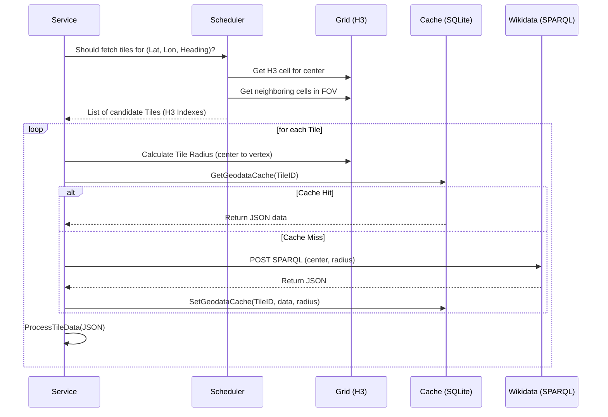

# PhileasGo: System Architecture & Data Flows (v0.2.47)

This document provides a technical source of truth for the core logic of PhileasGo as of version **v0.2.47**.

---

## 1. Wikidata Tile Pipeline
Converts flight telemetry into Points of Interest.

### Trigger: The Tick
- **Frequency**: Every 1 second (`service.go`).
- **Telemetry**: Fetched from SimConnect: `Latitude`, `Longitude`, `Heading`, `AltitudeAGL`, `IsOnGround`.

### Flow Breakdown

---

## 2. Classification & Rescue
How the system determines if a Wikidata item is worthy of being a POI.

### Phase 1: Direct Matching (The Fast Path)
Before any network calls, the system checks the `categories.yaml` configuration for direct hits:
1. **Static Lookup**: If the QID matches a known specific landmark or a "Root Category" QID (e.g., Q62447 for Aerodrome).
2. **Dynamic Interests**: If a Qid is temporarily flagged (e.g., via user interaction or simulator state).

### Phase 2: Taxonomy Traversal (The BFS Engine)
If no direct match exists, the system starts a **layered Breadth-First Search (BFS)** starting from the item's **P31 (Instance Of)** claims.

1. **Depth Limit**: The traversal stops at **4 layers** deep to prevent performance degradation.
2. **Structural Caching**: Every node (class) encountered is saved in the `wikidata_hierarchy` table.
    - **Full Node**: Contains Category, Parents (P279), and Name.
    - **Structural Node**: Saved with an empty Category (`""`) to indicate it's a pass-through node that has been visited but doesn't map directly to a category.
    - **Ignored Node**: Marked specifically to block sub-trees of the taxonomy.
3. **Traversal Rules**:
    - **Batching**: Missing nodes in a layer are fetched as a single batch from the Wikidata API.
    - **Priority**: Within each layer, a `Match` for a category is prioritized over an `Ignore` signal.
    - **Persistence**: Results are committed to the SQLite DB to ensure that second visits to the same category (e.g., different types of "Castle") are instant.

### Phase 3: Landmark Rescue (Dimension Tracking)
Items that fail to classify into a known category are eligible for **Rescue** if they are geometrically significant.

1. **Eligibility**: An article is **never** rescued if any of its direct P31 instances are explicitly in the `IgnoredCategories` config.
2. **The Dimensions**: The system tracks `Height`, `Length`, and `Area` (calculated or fetched from SPARQL).
3. **Median Window**: The `DimensionTracker` maintains a sliding window of the **Max Dimensions** from the last **10 tiles**.
4. **Rescue Thresholds**:
    - **Local Hero**: If an item's dimension is the **Maximum** in the current tile, it is rescued as a "Landmark".
    - **Global Giant**: If an item exceeds the **Median of the Maxima** from the 10-tile window, it is rescued.
5. **Scoring Impact**:
    - **Record/Giant Boost**: Rescued landmarks (or extremely large classified POIs) receive a `DimensionMultiplier`:
        - `x2.0`: If it's a Tile Record **OR** exceeds the Global Median.
        - `x4.0`: If it is **BOTH** a Tile Record and a Global Giant.

---

## 3. Hydration & Language Selection
How we determine the POI's Name and Wikipedia link.

### Logic (v0.2.47)
1. **Local Language Detection**: Sampler checks the **Country** at the tile center.
2. **Mapper Lookup**: returns the **Primary Language** for that country (ISO code).
3. **Length Fetching**: Article character counts are fetched from Wikipedia for:
    - **Local Language** article (e.g., `de`).
    - **English** article (`en`).
    - **User Language** article (from config).
4. **Selection Logic** (`determineBestArticle`):
    - The system compares the character counts of the three candidates (Local, English, User).
    - **Winner**: The longest article among these three becomes the primary source.
    - **Fallback**: If no lengths match, weights are: User > English > Local > Wikidata.

---

## 4. Narration Selection & LOS
The automated loop that triggers "Ava" to speak.

### Logic: `NarrationJob` (`scheduler.go`)
1. **Cooldown**: A randomized timer (`CooldownMin` to `CooldownMax`). Starts counting only **after** the previous narration has finished playing.
2. **Candidate Selection**: Hits `poiMgr.GetCandidates()` to get all active POIs (sorted by score).
3. **Line-of-Sight (LOS)**:
    - If `Terrain.LineOfSight` is enabled, the job iterates through candidates starting from the highest score.
    - It performs a 3D ray-check between aircraft and POI using **ETOPO1** elevation data.
    - **Tolerance**: 50m vertical offset (grazing-ray buffer).
    - **Selection**: The first POI with valid LOS and `Score > MinScoreThreshold` (0.01) is selected.
4. **Essay Fallback**:
    - If no POIs have LOS, or the aircraft is above 2000ft AGL, the system may trigger a "Regional Essay" on a general topic (Geography, Aviation, History).

---

## Final Verification Checklist
Files to audit against this document:
- [ ] **H3 Resolution**: `pkg/wikidata/grid.go` (`h3Resolution`).
- [ ] **Classification Path**: `pkg/classifier/classifier.go` (`Classify`).
- [ ] **Language Mapping**: `pkg/wikidata/mapper.go` (SPARQL query in `refresh`).
- [ ] **Article Winner**: `pkg/wikidata/service_enrich.go` (`determineBestArticle`).
- [ ] **Selection Loop**: `pkg/core/scheduler.go` (`getVisibleCandidate`).
