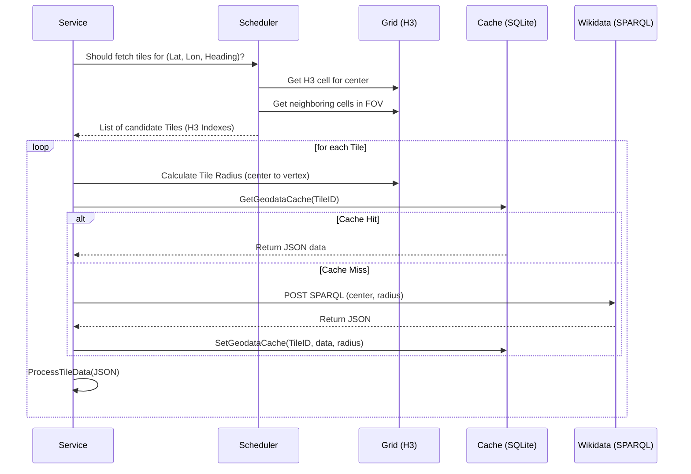

# PhileasGo: System Architecture & Data Flows (v0.2.47)

This document provides a technical source of truth for the core logic of PhileasGo as of version **v0.2.47**.

---

## 1. Wikidata Tile Pipeline
Converts flight telemetry into Points of Interest.

### Trigger: The Tick
- **Frequency**: Every 1 second (`service.go`).
- **Telemetry**: Fetched from SimConnect: `Latitude`, `Longitude`, `Heading`, `AltitudeAGL`, `IsOnGround`.

### Flow Breakdown

---

## 2. Classification & Rescue
How we determine if a Wikidata item is a POI.

### Flow Breakdown
1. **Config Match**: Checks if the QID is a direct match in `categories.yaml`.
2. **P31 Lookup**: Fetches the "Instance Of" (P31) claims.
3. **Hierarchy Walk (BFS)**: 
    - Traverses up the "Subclass Of" (P279) chain (max depth 4).
    - Checks for matches against configured categories.
    - Results are cached in `wikidata_hierarchy` table.
4. **Rescue Logic** (`classifier.go`):
    - If no category is found, the item is checked for **Landmark** status.
    - It must exceed the **Median Dimensions** (Height, Length, or Area) of objects observed in the window (Current and last 10 tiles).

---

## 3. Hydration & Language Selection
How we determine the POI's Name and Wikipedia link.

### Logic (v0.2.47)
1. **Local Language Detection**: Sampler checks the **Country** at the tile center.
2. **Mapper Lookup**: returns the **Primary Language** for that country (ISO code).
3. **Length Fetching**: Article character counts are fetched from Wikipedia for:
    - **Local Language** article (e.g., `de`).
    - **English** article (`en`).
    - **User Language** article (from config).
4. **Selection Logic** (`determineBestArticle`):
    - The system compares the character counts of the three candidates (Local, English, User).
    - **Winner**: The longest article among these three becomes the primary source.
    - **Fallback**: If no lengths match, weights are: User > English > Local > Wikidata.

---

## 4. Narration Selection & LOS
The automated loop that triggers "Ava" to speak.

### Logic: `NarrationJob` (`scheduler.go`)
1. **Cooldown**: A randomized timer (`CooldownMin` to `CooldownMax`). Starts counting only **after** the previous narration has finished playing.
2. **Candidate Selection**: Hits `poiMgr.GetCandidates()` to get all active POIs (sorted by score).
3. **Line-of-Sight (LOS)**:
    - If `Terrain.LineOfSight` is enabled, the job iterates through candidates starting from the highest score.
    - It performs a 3D ray-check between aircraft and POI using **ETOPO1** elevation data.
    - **Tolerance**: 50m vertical offset (grazing-ray buffer).
    - **Selection**: The first POI with valid LOS and `Score > MinScoreThreshold` (0.01) is selected.
4. **Essay Fallback**:
    - If no POIs have LOS, or the aircraft is above 2000ft AGL, the system may trigger a "Regional Essay" on a general topic (Geography, Aviation, History).

---

## Final Verification Checklist
Files to audit against this document:
- [ ] **H3 Resolution**: `pkg/wikidata/grid.go` (`h3Resolution`).
- [ ] **Classification Path**: `pkg/classifier/classifier.go` (`Classify`).
- [ ] **Language Mapping**: `pkg/wikidata/mapper.go` (SPARQL query in `refresh`).
- [ ] **Article Winner**: `pkg/wikidata/service_enrich.go` (`determineBestArticle`).
- [ ] **Selection Loop**: `pkg/core/scheduler.go` (`getVisibleCandidate`).
