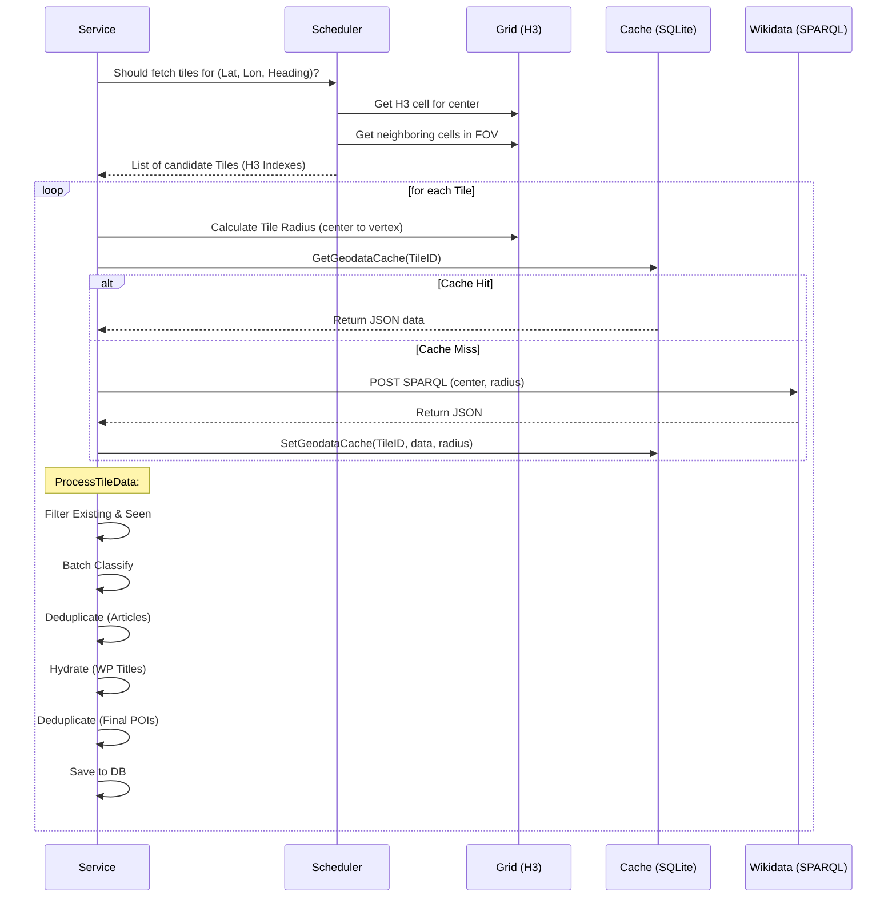

# PhileasGo: System Architecture & Data Flows (v0.2.47)

This document provides a technical source of truth for the core logic of PhileasGo as of version **v0.2.47**.

---

## 1. Wikidata Tile Pipeline
Converts flight telemetry into Points of Interest.

### Trigger: The Tick
- **Frequency**: Every 1 second (`service.go`).
- **Telemetry**: Fetched from SimConnect: `Latitude`, `Longitude`, `Heading`, `AltitudeAGL`, `IsOnGround`.

### Flow Breakdown

---

## 2. Classification & Rescue
How the system determines if a Wikidata item is worthy of being a POI.

### Phase 1: Direct Matching (The Fast Path)
Before any network calls, the system checks the `categories.yaml` configuration for direct hits:
1. **Static Lookup**: If the QID matches a known specific landmark or a "Root Category" QID (e.g., Q62447 for Aerodrome).
2. **Dynamic Interests (AI Extensions)**: Regional subclasses (P279) suggested by Gemini based on location, mapping specialized QIDs to either existing or new "Dynamic" categories.

### Phase 2: Taxonomy Traversal (The BFS Engine)
If no direct match exists, the system starts a **layered Breadth-First Search (BFS)** starting from the item's **P31 (Instance Of)** claims.

1. **Depth Limit**: The traversal stops at **4 layers** deep to prevent performance degradation.
2. **Structural Caching**: Every node (class) encountered is saved in the `wikidata_hierarchy` table.
    - **Full Node**: Contains Category, Parents (P279), and Name.
    - **Structural Node**: Saved with an empty Category (`""`) to indicate it's a pass-through node that has been visited but doesn't map directly to a category.
    - **Ignored Node**: Marked specifically to block sub-trees of the taxonomy.
3. **Traversal Rules**:
    - **Batching**: Missing nodes in a layer are fetched as a single batch from the Wikidata API.
    - **Priority**: Within each layer, a `Match` for a category is prioritized over an `Ignore` signal.
    - **Persistence**: Results are committed to the SQLite DB to ensure that second visits to the same category (e.g., different types of "Castle") are instant.

### Phase 3: Landmark Rescue (Dimension Tracking)
Items that fail to classify into a known category are eligible for **Rescue** if they are geometrically significant.

1. **Eligibility**: An article is **never** rescued if any of its direct P31 instances are explicitly in the `IgnoredCategories` config.
2. **The Dimensions**: The system tracks `Height` (P2048), `Length` (P2043), and `Area` (P2046). These are **straight-fetched** from SPARQL as raw floats; no secondary calculation (like Length * Width) or unit conversion is performed by the server.
3. **Median Window**: The `DimensionTracker` maintains a sliding window of the **Max Dimensions** from the last **10 tiles**.
4. **Rescue Thresholds**:
    - **Local Hero**: If an item's dimension is the **Maximum** in the current tile, it is rescued as a "Landmark".
    - **Global Giant**: If an item exceeds the **Median of the Maxima** from the 10-tile window, it is rescued.
5. **Scoring Impact**:
    - **Record/Giant Boost**: Rescued landmarks (or extremely large classified POIs) receive a `DimensionMultiplier`:
        - `x2.0`: If it's a Tile Record **OR** exceeds the Global Median.
        - `x4.0`: If it is **BOTH** a Tile Record and a Global Giant.

---

## 3. Hydration & Language Selection
How we determine the POI's Name and Wikipedia link.

### Logic (v0.2.47)
1. **Multi-Point Language Detection**: The system samples the **Country** at the **Tile Center** AND all **6 Corner Vertices** of the H3 hex.
2. **Mapper Lookup**: It resolves this set of countries to **ALL their Official Languages** (ISO codes) via a cached Wikidata mapping. This builds a deduplicated, prioritized list of regional languages.
3. **Length Fetching**: Article character counts are fetched from Wikipedia for:
    - **All Regional Languages** detected in the tile (e.g., `de`, `fr` if on a border).
    - **English** article (`en`).
    - **User Language** article (from config).
4. **Selection Logic** (`determineBestArticle`):
    - The system compares the character counts of all candidates.
    - **Tie-Breaker**: If lengths are similar, the system prefers languages in the order they were detected (Center > Vertices).
    - **Winner**: The longest article among the candidates becomes the primary source.
    - **Fallback**: If no lengths match, weights are: User > English > Local > Wikidata.

---

## 4. Spatial Deduplication (The Merger)
How the system prevents clustering and "POI soup" by merging nearby items.

### Two-Stage Merging
PhileasGo performs deduplication at two different points in the ingest flow for efficiency:

1. **Stage 1: Pre-Hydration (`MergeArticles`)**:
    - **Where**: `processAndHydrate` (before fetching Wikipedia titles/lengths).
    - **Purpose**: Optimization. By merging items early using **Wikidata Sitelinks** as a proxy for quality, the system avoids thousands of redundant API calls to Wikipedia for POIs that would ultimately be merged anyway.
2. **Stage 2: Post-Hydration (`MergePOIs`)**:
    - **Where**: `enrichAndSave` (after fetching full metadata).
    - **Purpose**: Final Polish. Uses actual **Article Lengths** to ensure the highest-quality POI remains as the "survivor" and "gobbles" the scores of merged neighbors.

### Merge Rules
- **Distance**: The required distance between POIs depends on their **Category** (e.g., small distance for statues, large distance for cities).
- **Quality**: The POI with the higher **Article Length** (or Sitelink count in Stage 1) survives and inherits the proximity of its neighbors.
- **Category Sizes**: Defined in `categories.yaml` (S, M, L, XL).

---

## 5. LanguageMapper & Country Detection
The component responsible for resolving geographic coordinates to human languages.

### Operation
- **Cold Start**: On service start, it attempts to load the mapping from the persistence store (`sys_lang_map_v4`).
- **Wikidata Sync**: if the cache is empty, it executes a broad SPARQL query across all countries to fetch:
    - **ISO Country Code** (P297).
    - **Official Languages** (P37) and their **Wikimedia Codes** (P424).
- **Mapping**: It maintains a `map[string][]LanguageInfo`, supporting countries with multiple official languages (e.g., Switzerland, Canada).
- **Refresh**: The map is intended to be refreshed monthly (`refreshInterval = 30 days`).

### Runtime Resolution
1. **Reverse Geocode**: `geo.Service` finds the nearest city (from `cities1000.txt`) to get the country code.
2. **Mapper Lookup**: `LanguageMapper.GetLanguages(cc)` returns all official language codes.
3. **Fallback**: If a country is not in the map, it defaults to **English** (`en`).

---

## 5. Narration Selection & LOS
The automated loop that triggers "Ava" to speak.

### Logic: `NarrationJob` (`scheduler.go`)
1. **Cooldown**: A randomized timer (`CooldownMin` to `CooldownMax`). Starts counting only **after** the previous narration has finished playing.
2. **Candidate Selection**: Hits `poiMgr.GetCandidates()` to get all active POIs (sorted by score).
3. **Line-of-Sight (LOS)**:
    - If `Terrain.LineOfSight` is enabled, the job iterates through candidates starting from the highest score.
    - It performs a 3D ray-check between aircraft and POI using **ETOPO1** elevation data.
    - **Tolerance**: 50m vertical offset (grazing-ray buffer).
    - **Selection**: The first POI with valid LOS and `Score > MinScoreThreshold` (0.01) is selected.
4. **Essay Fallback**:
    - If no POIs have LOS, or the aircraft is above 2000ft AGL, the system may trigger a "Regional Essay" on a general topic (Geography, Aviation, History).

---

## 6. Dynamic Categories & AI Extensions
How PhileasGo adapts its taxonomy to the current region.

### The Problem
A static list of categories (Castles, Airports, etc.) cannot capture the cultural or geological richness of every region on Earth (e.g., "Moai" in Easter Island or "Shinto Shrines" in Japan).

### The Solution: `DynamicConfigJob`
Every **30 minutes** or **50nm** of travel, the system triggers a background task:
1. **Context Batching**: The system sends the current Country, Region, and a list of all **Static Categories** to Gemini.
2. **AI Suggestion**: Gemini suggests 3-5 Wikidata **subclasses** (Classes, not Instances) that are iconic to that specific region.
3. **Taxonomy Mapping**:
    - Gemini attempts to map each suggestion to a **Static Category** (e.g., a "Moorish Castle" -> "Castle").
    - If no static category fits, Gemini provides a **Specific Category** name (e.g., "Buddhist Temple"). This becomes a **Dynamic Category**.
4. **Validation**: The suggested QIDs are validated via a SPARQL metadata check to ensure they are valid classes.
5. **Injection**: Validated QIDs are injected into the `Classifier` as **Dynamic Interests**.

### Impact on Flows
- **Classification**: Phase 1 (Direct Matching) now hits the `Dynamic Interests` map first.
- **Scoring**: Since Dynamic Categories aren't in `categories.yaml`, they inherit **Default Weights** (1.0) and **Medium Size** ("M").
- **Narration**: Ava uses the `specific_category` name in her descriptions, providing a much higher level of localized "Tour Guide" expertise.
- **Persistence**: These interests are **In-Memory only**. They expire when the flight moves to a new region or the server restarts, ensuring the "Interest Window" remains relevant to the current geography.

---

## Final Verification Checklist
Files to audit against this document:
- [ ] **H3 Resolution**: `pkg/wikidata/grid.go` (`h3Resolution`).
- [ ] **Classification Path**: `pkg/classifier/classifier.go` (`Classify`).
- [ ] **Spatial Merging**: `pkg/wikidata/merger.go`.
- [ ] **Language Mapping**: `pkg/wikidata/mapper.go` (SPARQL query in `refresh`).
- [ ] **Article Winner**: `pkg/wikidata/service_enrich.go` (`determineBestArticle`).
- [ ] **Selection Loop**: `pkg/core/scheduler.go` (`getVisibleCandidate`).

---

## Technical Documentation Backlog (TODO)
The following areas are slated for detailed documentation in future updates:

1. **Marker Beacons**: Detailed breakdown of the balloon/beacon spawning logic, line-of-sight visual indicators, and altitude-locking behavior for low-level flight.
2. **Narration Flow**: Step-by-step trace from POI selection in the `NarrationJob` to the final TTS output, including queuing and concurrency handling.
3. **Prompt Engine**: Technical specification of the `model.NarrationPromptData`, template inheritance (`azure.tmpl`, etc.), and the linguistic "Skew Strategy" for narration length.
